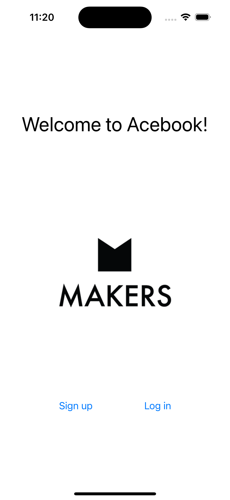
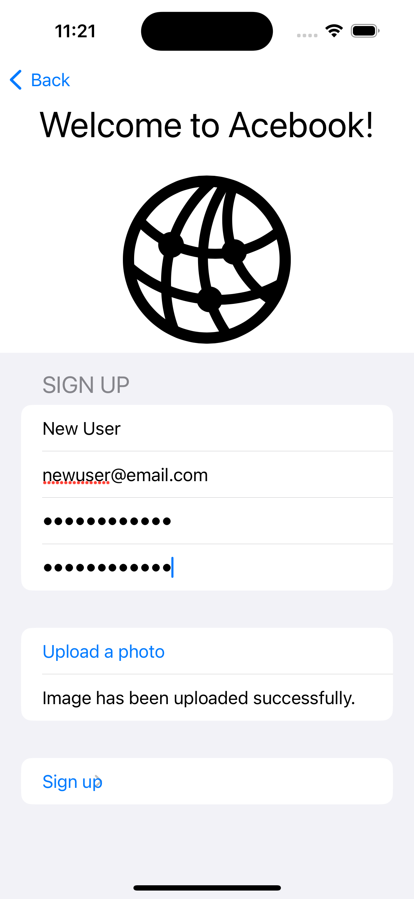
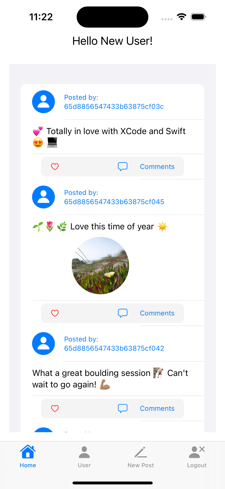
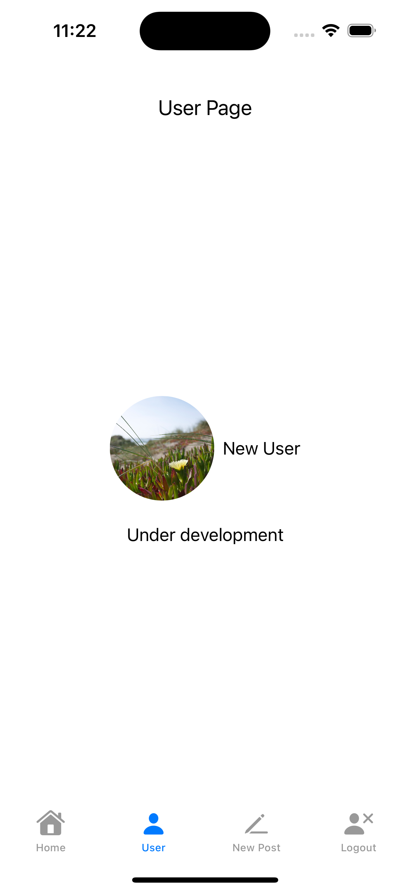
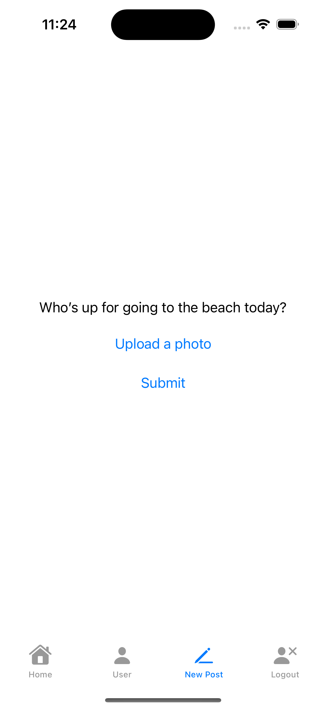
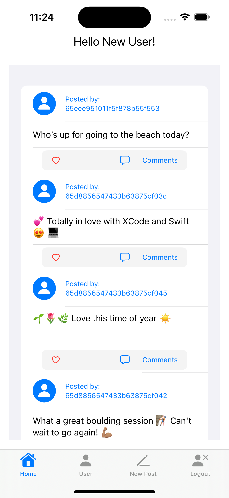

# Acebook Mobile
Acebook Mobile was a one-week Makers Academy project, testing our ability to rapidly learn a new language and develop a SwiftUI app that connects to an [existing MERN backend](https://github.com/makersacademy/Mobile-Acebook-backend). Our team of five junior developers planned, designed and built the app over five days, deciding what to develop and in what way.

With Acebook Mobile, Users can:
- Sign up and log in securely
- Add a profile photo that is stored in the cloud
- View posts by other users
- Add their own posts with text and photos
- Log out

## Tech stack

 

## Team
- [Dan Gullis](https://github.com/dgullis)
- [Simon Budden](https://github.com/fantastito)
- [Jack Tungavo](https://github.com/JackTungavo)
- [Josh Bhogal](https://github.com/DLae)
- [Nathan Wing](https://github.com/nlswing)

# Objectives
The Acebook Mobile project was set after a week's introduction to Swift and SwiftUI. The challenge was to develop a multi-view SwiftUI application that was integrated with an existing backend using RESTful APIs. It was also an opportunity to practice modern software development practices, such as agile working.

# Development process
We began by planning our app, coming up with an MVP with the core features of a social media app (having an account, viewing posts, making posts), and divided the work into two two-day sprints. We tracked our work using a Trello board, resolving tickets with a mix of pair and solo programming.

Makers provided a number of resources on aspects of the app's development but we were expected to problem solve ourselves to create the final app.

The project proved a challenging but enriching experience. Using SwiftUI and XCode came with a considerable learning curve but simulated the varied environments that can be expected in software development. Similarly, we gained valuable experience of integrating front- and backend services with RESTful APIs, considering UI design for mobile apps, and handling data management.

# Screenshots
<table>
  <tr>
    <td></td>
    <td></td>
  </tr>
  <tr>
    <td></td>
    <td></td>
  </tr>
   <tr>
    <td></td>
    <td></td>
  </tr>
</table>
